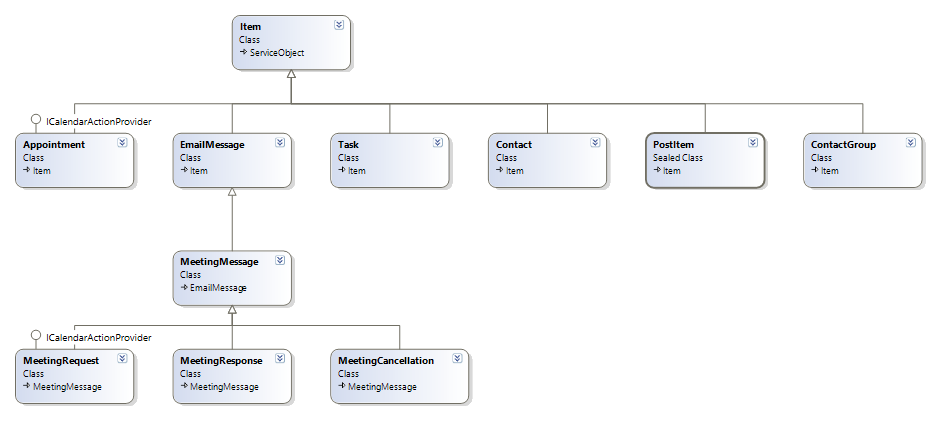
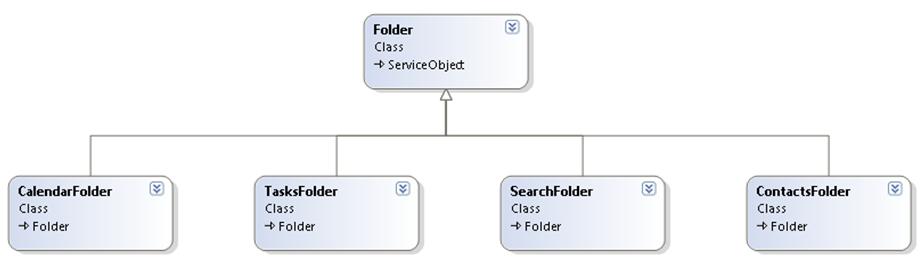

[](https://travis-ci.org/OfficeDev/ews-java-api)

# Getting Started with the EWS JAVA API

## Using the EWS JAVA API for https

To make an environment secure, you must be sure that any communication is with "trusted" sites. SSL uses certificates for authentication — these are digitally signed documents that bind the public key to the identity of the private key owner.

For testing the application with https, you don't have to add any additional code because the code is built into the API.

## Accessing EWS by using the EWS JAVA API
To access Exchange Web Services (EWS) by using the EWS JAVA API, all you need is an instance of the ExchangeService class, as shown in the following example.
```
ExchangeService service = new ExchangeService(ExchangeVersion.Exchange2010_SP2);
ExchangeCredentials credentials = new WebCredentials("emailAddress", "password");
service.setCredentials(credentials);
```

## Setting the URL of the Service
You can set the URL of the service in one of two ways:
- Manually, if you know the URL of EWS or if you have previously determined it via the Autodiscover service.
- By using the Autodiscover service.

To set the URL manually, use the following:

```
service.setUrl(new Uri("<ews_url>"));
```
To set the URL by using Autodiscover, use the following:

```
service.autodiscoverUrl("<your_email_address>");
```

We recommend that you use the Autodiscover service, for the following reasons:

- Autodiscover determines the best endpoint for a given user (the endpoint that is closest to the user’s Mailbox server).
- The EWS URL might change as your administrators deploy new Client Access servers.

You can safely cache the URL that is returned by the Autodiscover service and reuse it. Autodiscover should be called periodically, or when EWS connectivity to a given URL is lost.
Note that you should either set the URL manually or call AutodiscoverUrl, but you should not do both.

## Items

The EWS JAVA API defines a class hierarchy of items. Each class in the hierarchy maps to a given item type in Exchange. For example, the `EmailMessage` class represents email messages and the `Appointment` class represents calendar events and meetings.

The following figure shows the EWS JAVA API item class hierarchy.



## Folders

The Folder operations provide access to folders in the Exchange data store. A client application can create, update, delete, copy, find, get, and move folders that are associated with a mailbox user. Folders are used to gain access to items in the store, and provide a reference container for items in the store.

The EWS JAVA API also defines a class hierarchy for folders, as shown in the following figure.



## Item and Folder Identifiers

Items and folders in Exchange are uniquely identified. In the EWS JAVA API, items and folders have an ID property that holds their Exchange unique identity. The ID of an item is of type `ItemId`; the ID of a folder is of type `FolderId`.

## Binding to an Existing Item

If you know the unique identifier of an email message and want to retrieve its details from Exchange, you have to write the following.

```
// Bind to an existing message using its unique identifier.
EmailMessage message = EmailMessage.bind(service, new ItemId(uniqueId));

// Write the sender's name.
System.out.println(message.getSender().getName());

```
If you do not know what type of item the unique identifier maps to, you can also write the following.

```
// Bind to an existing item using its unique identifier.
Item item = Item.bind(service, new ItemId(uniqueId));

if (item.equals(message))
{
	// If the item is an e-mail message, write the sender's name.
	System.out.println((item(EmailMessage)).getSender().getName());
}
else if (item.equals(Appointment))
{
	// If the item is an appointment, write its start time.
	System.out.println((item(Appointment).Start));
}
else
{
	// Handle other types.
}
```

## Binding to an Existing Folder

Bind to an existing folder in the same way that you bind to an existing item.

```
// Bind to an existing folder using its unique identifier.
Folder folder = Folder.bind(service, new FolderId(uniqueId));
```
You can also bind to a well-known folder (Inbox, Calendar, Tasks, and so on) without knowing its ID.

```
// Bind to the Inbox.
Folder inbox = Folder.bind(service, WellKnownFolderName.Inbox);
```

## Sending a Message

```
EmailMessage msg= new EmailMessage(service);
msg.setSubject("Hello world!");
msg.setBody(MessageBody.getMessageBodyFromText("Sent using the EWS Java API."));
msg.getToRecipients().add("someone@contoso.com");
msg.send();
```

## Creating a Recurring Appointment

To schedule a recurring appointment, create an appointment for the first meeting time, and choose 'Recurrence.' Outlook will use your initial appointment as a start date. Set the end date by specifying a date for the recurring appointments to end or a number of occurrences for this recurring appointment. You can also specify no end date. If the meeting will occur on more than one day of the week, choose the days on which the meeting/appointment will occur.
You can use the EWS JAVA API to create a recurring appointment, as shown in the following code.

```
Appointment appointment = new Appointment(service);
appointment.setSubject("Recurrence Appointment for JAVA XML TEST");
appointment.setBody(MessageBody.getMessageBodyFromText("Recurrence Test Body Msg"));

SimpleDateFormat formatter = new SimpleDateFormat("yyyy-MM-dd HH:mm:ss");
Date startDate = formatter.parse("2010-05-22 12:00:00");
Date endDate = formatter.parse("2010-05-22 13:00:00");

appointment.setStart(startDate);//new Date(2010-1900,5-1,20,20,00));
appointment.setEnd(endDate); //new Date(2010-1900,5-1,20,21,00));

formatter = new SimpleDateFormat("yyyy-MM-dd");
Date recurrenceEndDate = formatter.parse("2010-07-20");

appointment.setRecurrence(new Recurrence.DailyPattern(appointment.getStart(), 3));

appointment.getRecurrence().setStartDate(appointment.getStart());
appointment.getRecurrence().setEndDate(recurrenceEndDate);
appointment.save();
```

## Inviting Attendees to the Previously Created Appointment to Make it a Meeting

```
appointment.getRequiredAttendees().add("someone@contoso.com");
appointment.update(ConflictResolutionMode.AutoResolve);
```
*Note:* You can also do this when you create the meeting.

## Deleting an Item of Any Type

```
message.delete(DeleteMode.HardDelete);
```

## Creating a Folder

The following code shows how to create a folder by using the EWS JAVA API.

```
Folder folder = new Folder(service);
folder.setDisplayName("EWS-JAVA-Folder");
// creates the folder as a child of the Inbox folder.
folder.save(WellKnownFolderName.Inbox); 
```

## Searching

### List the first 10 items in the Inbox

You can use EWS to list the first 10 items in the user's mailbox. The following code shows how to search for a list of first 10 items in the Inbox by using the EWS JAVA API.

```
public void listFirstTenItems()
{
	ItemView view = new ItemView(10);
	FindItemsResults<Item> findResults = service.findItems(folder.getId(), view);

	for (Item item : findResults1.getItems())
	{
		// Do something with the item as shown
		System.out.println("id==========" + item.getId());
		System.out.println("sub==========" + item.getSubject());
	}
}
```

### Retrieve all the items in the Inbox by groups of 50 items

```
public void pageThroughEntireInbox()
{
	ItemView view = new ItemView(50);
	FindItemsResults<Item> findResults;

	do
	{
		findResults = service.FindItems(WellKnownFolderName.Inbox, view);

		for(Item item : findResults.getItems())
		{
			// Do something with the item.
		}

		view.Offset += 50;
    } while (findResults.MoreAvailable);
}
```

### Find the first 10 messages in the Inbox that have a subject that contains the words "EWS" or "API", order by date received, and only return the Subject and DateTimeReceived properties.

```
public void findItems()
{
	ItemView view = new ItemView(10);
	view.getOrderBy().add(ItemSchema.DateTimeReceived, SortDirection.Ascending);
	view.setPropertySet(new PropertySet(BasePropertySet.IdOnly, ItemSchema.Subject, ItemSchema.DateTimeReceived));

	FindItemsResults<Item> findResults =
    	service.findItems(WellKnownFolderName.Inbox,
        	new SearchFilter.SearchFilterCollection(
				LogicalOperator.Or, new SearchFilter.ContainsSubstring(ItemSchema.Subject, "EWS"),
			new SearchFilter.ContainsSubstring(ItemSchema.Subject, "API")), view);

	System.out.println("Total number of items found: " + findResults.getTotalCount());

	for (Item item : findResults)
	{
		System.out.println(item.getSubject());
		System.out.println(item.getBody());
		// Do something with the item.
	}
}
```

### Find all child folders of the Inbox folder

Use the FindFolder operation to search in all child folders of the identified parent folder; for example, you can search all child folders of the Inbox, as shown in the following example.

```
public void findChildFolders()
{
	FindFoldersResults findResults = service.findFolders(WellKnownFolderName.Inbox, new FolderView(Integer.MAX_VALUE));

	for (Folder folder : findResults.getFolders())
	{
		System.out.println("Count======" + folder.getChildFolderCount());
		System.out.println("Name=======" + folder.getDisplayName());
	}
}
```

### Get all appointments between startDate and endDate in the specified folder, including recurring meeting occurrences

The following example shows you how to get all appointments between startDate and endDate in the specified folder, including recurring meeting occurrences.

```
public void findAppointments(CalendarFolder folder, Date startDate, Date endDate)
{
	SimpleDateFormat formatter = new SimpleDateFormat("yyyy-MM-dd HH:mm:ss");
	Date startDate = formatter.parse("2010-05-01 12:00:00");
	Date endDate = formatter.parse("2010-05-30 13:00:00");
	CalendarFolder cf=CalendarFolder.bind(service, WellKnownFolderName.Calendar);
	FindItemsResults<Appointment> findResults = cf.findAppointments(new CalendarView(startDate, endDate));
	for (Appointment appt : findResults.getItems())
	{
		System.out.println("SUBJECT====="+appt.getSubject());
		System.out.println("BODY========"+appt.getBody());
	}
}
```

## Resolving an Ambiguous Name

You can resolve a partial name against the Active Directory directory service and the Contacts folder (in that order), as shown in the following example.

```
// Resolve a partial name against the Active Directory and the Contacts folder (in that order).
NameResolutionCollection nameResolutions = service.resolveName("test",ResolveNameSearchLocation.ContactsOnly, true);
System.out.println("nameResolutions==="+nameResolutions.getCount());

for (NameResolution nameResolution : nameResolutions)
{
	System.out.println("NAME==="+nameResolution.getMailbox().getName());
	System.out.println(" PHONENO===" +nameResolution.getMailbox().getMailboxType());
}
```

## Extended Properties

Items in the EWS JAVA  API expose strongly typed, first-class properties that provide easy access to the most commonly used properties (for example, `Item.Subject`, `Item.Body`, `EmailMessage.ToRecipients`, `Appointment.Start` and `Contact.Birthday`). Exchange allows for additional properties to be added to items. In EWS, these are called extended properties.

To stamp an email message with a custom extended property, do the following.

```
// Create a new email message.
EmailMessage message = new EmailMessage(service);
message.setSubject("Message with custom extended property");

// Define a property set identifier. This identifier should be defined once and
// reused wherever the extended property is accessed. For example, you can
// define one property set identifier for your application and use it for all the
// custom extended properties that your application reads and writes.
//
// NOTE: The following is JUST AN EXAMPLE. You should generate NEW GUIDs for your
// property set identifiers. This way, you will ensure that there won't be any conflict
// with the extended properties your application sets and the extended properties
// other applications set.
UUID yourPropertySetId = UUID.fromString("01638372-9F96-43b2-A403-B504ED14A910");

// Define the extended property itself.
ExtendedPropertyDefinition extendedPropertyDefinition = new ExtendedPropertyDefinition(
	yourPropertySetId,
	"MyProperty",
	MapiPropertyType.String);

// Stamp the extended property on a message.
message.setExtendedProperty(extendedPropertyDefinition, "MyValue");

// Save the message.
message.save();
```

## Availability Service

The EWS Java API makes it very easy to consume the Availability service. The Availability service makes it possible to retrieve free/busy information for users for whom the caller does not necessarily have access rights. It also provides meeting time suggestions.

The following example shows how to call the Availability service by using the EWS Java API.

```
// Create a list of attendees for which to request availability
// information and meeting time suggestions.

List<AttendeeInfo> attendees = new ArrayList<AttendeeInfo>();
attendees.add(new AttendeeInfo("test@contoso.com"));
attendees.add(new AttendeeInfo("temp@contoso.com"));

SimpleDateFormat formatter = new SimpleDateFormat("yyyy/MM/dd");
Date start = formatter.parse("2010/05/18");
Date end = formatter.parse("2010/05/19");

// Call the availability service.
GetUserAvailabilityResults results = service.getUserAvailability(
	attendees,
	new TimeWindow(start, end),
	AvailabilityData.FreeBusyAndSuggestions);

// Output attendee availability information.
int attendeeIndex = 0;

for (AttendeeAvailability attendeeAvailability : results.getAttendeesAvailability())
{
	System.out.println("Availability for " + attendees.get(attendeeIndex));
	if (attendeeAvailability.getErrorCode() == ServiceError.NoError)
	{
		for (CalendarEvent calendarEvent : ttendeeAvailability.getCalendarEvents())
		{
			System.out.println("Calendar event");
			System.out.println("  Start time: " + CalendarEvent.getStartTime().toString());
			System.out.println("  End time: " + calendarEvent.getEndTime().toString());

			if (calendarEvent.getDetails() != null)
			{
				System.out.println("  Subject: " + calendarEvent.getDetails().getSubject());
				// Output additional properties.
			}
		}
	}

	attendeeIndex++;
}


// Output suggested meeting times.
for (Suggestion suggestion : results.getSuggestions())
{
	System.out.println("Suggested day: " + suggestion.getDate().toString());
	System.out.println("Overall quality of the suggested day: " + suggestion.getQuality().toString());

	for (TimeSuggestion timeSuggestion : suggestion.getTimeSuggestions())
	{
		System.out.println("  Suggested time: " + timeSuggestion.getMeetingTime().toString());
		System.out.println("  Suggested time quality: " + timeSuggestion.getQuality().toString());
		// Output additonal properties.
	}
}
```

## Notifications

EWS allows client applications to subscribe to event notifications. This  makes it possible to determine what events occurred on a specific folder since a specific point in time (for example, what items were created, modified, moved, or deleted).

There are two types of subscriptions: pull subscriptions and push subscriptions. With pull subscriptions, the client application has to poll the server regularly to retrieve the list of events that occurred since the last time the server was polled. With push subscriptions, Exchange directly notifies the client application when an event occurs.

### Using pull notifications with the EWS JAVA API

The following example shows how to subscribe to pull notifications and how to retrieve the latest events.

```
// Subscribe to pull notifications in the Inbox folder, and get notified when a new mail is received, when an item or folder is created, or when an item or folder is deleted.

List  folder = new ArrayList();
folder.add(new FolderId().getFolderIdFromWellKnownFolderName(WellKnownFolderName.Inbox));

PullSubscription subscription = service.subscribeToPullNotifications(folder,5
/* timeOut: the subscription will end if the server is not polled within 5 minutes. */, null /* watermark: null to start a new subscription. */, EventType.NewMail, EventType.Created, EventType.Deleted);

// Wait a couple minutes, then poll the server for new events.
GetEventsResults events = subscription.getEvents();

// Loop through all item-related events.
for(ItemEvent itemEvent : events.getItemEvents())
{
	if (itemEvent.getEventType()== EventType.NewMail)
	{
		EmailMessage message = EmailMessage.bind(service, itemEvent.getItemId());
	}
	else if(itemEvent.getEventType()==EventType.Created)
	{
		Item item = Item.bind(service, itemEvent.getItemId());
	}
	else if(itemEvent.getEventType()==EventType.Deleted)
	{
		break;
	}
 }

// Loop through all folder-related events.
for (FolderEvent folderEvent : events.getFolderEvents())
{
	if (folderEvent.getEventType()==EventType.Created)
	{
		Folder folder = Folder.bind(service, folderEvent.getFolderId());
	}
	else if(folderEvent.getEventType()==EventType.Deleted)
	{
		System.out.println("folder  deleted”+ folderEvent.getFolderId.UniqueId);
	}
}
```

### SubscribeToPullNotifications asynchronously

```
WellKnownFolderName wkFolder = WellKnownFolderName.Inbox;

FolderId folderId = new FolderId(wkFolder);

List<FolderId> folder = new ArrayList<FolderId>();

folder.add(folderId);

IAsyncResult subscription = getService().beginSubscribeToPullNotifications(new AsyncCallbackImplementation(),null,folder, 5, null, EventType.NewMail, EventType.Created, EventType.Deleted);

PullSubscription ps= getService().endSubscribeToPullNotifications(subscription);
```

### SubscribeToPullNotificationsOnAllFolders asynchronously

The following example shows how to subscribe to pull notifications on all folders.

```
// Subscribe to push notifications on the Inbox folder, and only listen
// to "new mail" events.

IAsyncResult asyncresult = getService().beginSubscribeToPullNotificationsOnAllFolders(null,null,5,null,

EventType.NewMail, EventType.Created, EventType.Deleted);

PullSubscription subscription = getService().endSubscribeToPullNotifications(asyncresult);

GetEventsResults events = subscription.getEvents();

System.out.println("events======" + events.getItemEvents());
```

## Using push notifications with the EWS JAVA API

The EWS Java API does not provide a built-in push notifications listener. It is the responsibility of the client application to implement such a listener.

The following example shows how to subscribe to push notifications.

```
// Subscribe to push notifications on the Inbox folder, and only listen
// to "new mail" events.
PushSubscription pushSubscription = service.SubscribeToPushNotifications(
	new FolderId[] { WellKnownFolderName.Inbox },
	new Uri("https://...") /* The endpoint of the listener. */,
	5 /* Get a status event every 5 minutes if no new events are available. */,
	null  /* watermark: null to start a new subscription. */,
	EventType.NewMail);
```

### BeginSubscribeToPushNotifications

The following example shows how to subscribe to push notifications.

```
WellKnownFolderName wkFolder = WellKnownFolderName.Inbox;
	FolderId folderId = new FolderId(wkFolder);
	List<FolderId> folder = new ArrayList<FolderId>();
	folder.add(folderId);
IAsyncResult result = getService().beginSubscribeToPushNotifications(null, null, folder, new URI(CredentialConstants.URL), 5, null, EventType.NewMail, EventType.Created, EventType.Deleted);
PushSubscription subscription = getService().endSubscribeToPushNotifications(result);
```

## Task

A task specifies a work item. 

You can use EWS to create tasks or to update tasks in a user's mailbox.

### Create a Task

The following code example shows how to create a task.

```
Task task = new Task(service);
task.setSubject("Task to test in JAVA");
task.setBody(MessageBody.getMessageBodyFromText("Test body from JAVA"));
task.setStartDate(new Date(2010-1900,5-1,20,17,00));
task.save();
```

## PostItem

The PostItem element represents a post item in the Exchange store.

A PostItem object is not sent to a recipient. You use the Post method, which is analogous to the Send method for the `MailItem` object, to save the `PostItem` to the target public folder instead of mailing it.

### PostItem Creation

The following code shows how to create PostItem by using the EWS Java API.

```
PostItem post = new PostItem(service);
post.setBody(new MessageBody("Test From JAVA: Body Content"));
post.setImportance(Importance.High);
post.setSubject("Test From JAVA: Subject");
String id =((Folder)findResults1.getFolders().get(0)).getId().toString();
System.out.println("Id : " +id);
post.save(new FolderId(id));
```

### PostItem Update

The following code shows how to update PostItem by using the EWS Java API.

```
PostItem post= PostItem.bind(service, new ItemId(uniqueId));
post.setSubject("post update in java");
post.setBody(MessageBody.getMessageBodyFromText("update post body in java"));
post.update(ConflictResolutionMode.AlwaysOverwrite);
```

## Contact Group

A contact group is an instance of the groups category. To persist a contact group between logon sessions, the new contact group category instance has to be published to the server.

You can add contacts even if a contact group does not exist. If you create your first contact group after you have added contacts, you can update each of your contacts to add them to the new contact group. If a contact group exists at the time you are adding a contact, you can place the new contact in the contact group as you are adding the contact.

### ContactGroup Creation

```
ContactGroup cgroup = new ContactGroup(service);
cgroup.setBody(new MessageBody("contact groups "));
cgroup.setDisplayName("test");
cgroup.save(folder.getId());
```

### Contact Group Updates

You can enable users to update their contact list by adding and removing contacts. 

```
Folder folder = Folder.bind(service, WellKnownFolderName.Contacts);
ItemView view = new ItemView(10);
FindItemsResults<Item> findResults = service.findItems(folder.getId(), view);
for (Item item : findResults.getItems())
{
      System.out.println("id:" + item.getId());
      System.out.println("sub==========" + item.getSubject());
}
ContactGroup cgroup = new ContactGroup(service);
ContactGroup c=cgroup.bind(service, new ItemId(uniqueId));
c.getMembers().addPersonalContact(new ItemId(uniqueId));
c.update(ConflictResolutionMode.AlwaysOverwrite);
```

## Contact

You can use EWS to create contact items in a mailbox.

### Contact Creation

You can use EWS to create contact items in a mailbox.
To create a Contact object, bind to the object that will contain the object, create a Contact object, set its properties and save the object to the directory store.

```
Contact contact = new Contact(service);
contact.setGivenName("ContactName");
contact.setMiddleName ("mName");
contact.setSurname("sName");
contact.setSubject("Contact Details");

// Specify the company name.
contact.setCompanyName("technolgies");
PhysicalAddressEntry paEntry1 = new PhysicalAddressEntry();
paEntry1.setStreet("12345 Main Street");
paEntry1.setCity("Seattle");
paEntry1.setState("orissa");
paEntry1.setPostalCode("11111");
paEntry1.setCountryOrRegion("INDIA");
contact.getPhysicalAddresses().setPhysicalAddress(PhysicalAddressKey.Home, paEntry1);
contact.save();
```

### Contact Updates

You can use EWS to update a contact item in the Exchange store.
Bind to an existing contact saves the changes made to a Contact item by updating its entry in the Contact collection.

```
Contact contact =  Contact.bind(service,new ItemId(uniqueId));
contact.setSubject("subject");
contact.setBody(new MessageBody("update contact body"));
contact.update(ConflictResolutionMode.AlwaysOverwrite);
```

## Email Message Attachment Support

You can get the attachment collection used to store data attached to an email message.
Use the collection returned by the Attachments property to add an attachment, such as a file or the contents of a Stream, to a `MailMessage`.

Create an attachment that contains or references the data to be attached, and then add the attachment to the collection returned by Attachments.

The following code shows how to support email message attachments by using the EWS JAVA API.

```
EmailMessage message = new EmailMessage(service);
message.getToRecipients().add("administrator@contoso.com");
message.setSubject("attachements");
message.setBody(MessageBody.getMessageBodyFromText("Email attachements"));
message.getAttachments().addFileAttachment("C:\\Documents and Settings\\test\\Desktop\\scenarios\\attachment.txt");
message.send();
```

## Appointment Creation

You can use EWS to create appointments in a user's mailbox. Appointments are blocks of time that appear in the Outlook calendar.

Appointments can have beginning and ending times, can repeat, and can have a location, as shown in the following example.

```
Appointment appointment = new  Appointment(service);
appointment.setSubject("Appointment for JAVA XML TEST");
appointment.setBody(MessageBody.getMessageBodyFromText("Test Body Msg in JAVA"));
SimpleDateFormat formatter = new  SimpleDateFormat("yyyy-MM-dd HH:mm:ss");
Date startDate = formatter.parse("2012-06-19 12:00:00");
Date endDate = formatter.parse("2012-06-19 13:00:00");
appointment.setStart(startDate);//new Date(2010-1900,5-1,20,20,00));
appointment.setEnd(endDate); //new Date(2010-1900,5-1,20,21,00));
appointment.save();
```

## Update an Appointment
You can use the EWS JAVA API to update appointments, as shown in the following example.

```
Appointment appointment= Appointment.bind(service, new  (uniqueId));
SimpleDateFormat formatter = new  SimpleDateFormat("yyyy-MM-dd HH:mm:ss");
Date startDate = formatter.parse("2012-06-19 13:00:00");
Date endDate = formatter.parse("2012-06-19 14:00:00");

appointment.setBody(MessageBody.getMessageBodyFromText("Appointement UPDATE done"));

appointment.setStart(startDate);
appointment.setEnd(endDate);
appointment.setSubject("Appointement UPDATE");
appointment.getRequiredAttendees().add("someone@contoso.com");
appointment.update(ConflictResolutionMode.AutoResolve);
```

## Meeting Request-Create

By adding attendees, you make the appointment a meeting.

Set properties on the appointment. The following code shows how to add a subject, a body, a start time, an end time, a location, two required attendees, and an optional attendee to an appointment, and how to create a meeting and send a meeting request to invitees.

```
// Create the appointment.
Appointment appointment = new  Appointment(service);

SimpleDateFormat formatter = new  SimpleDateFormat("yyyy-MM-dd HH:mm:ss");
Date startDate = formatter.parse("2012-06-19 13:00:00");
Date endDate = formatter.parse("2012-06-19 14:00:00");

// Set properties on the appointment. Add two required attendees and one optional attendee.
appointment.setSubject("Status Meeting");
appointment.setBody(new MessageBody("The purpose of this meeting is to discuss status.");
appointment.setStart(startDate);
appointment.setEnd(endDate);
appointment.setLocation(“Conf Room");
appointment.getRequiredAttendees().add("user1@contoso.com");
appointment.getRequiredAttendees().add("user2@contoso.com");
appointment.getOptionalAttendees().add("user3@contoso.com");

// Send the meeting request to all attendees and save a copy in the Sent Items folder.
appointment.save();
```

## Meeting Request-Update

The following code example shows how to update the subject, the location, the start time, and the end time of a meeting request, and add a user2@contoso.com as a new required attendee to the meeting request (user1@contoso.com was previously the only attendee). The updated meeting request is sent to all attendees and a copy is saved in the organizer's Sent Items folder.

```
// Bind to an existing meeting request by using its unique identifier.
Appointment appointment = Appointment.bind(service, new ItemId(uniqueId));

// Update properties on the meeting request.
appointment.setSubject("Status Meeting - Rescheduled/Moved");
appointment.setLocation("Conf Room 34");

// Add a new required attendee to the meeting request.
appointment.getRequiredAttendees().add("user1@contoso.com");

// Add a new optional attendee to the meeting request.
appointment.getRequiredAttendees().add("user2@contoso.com");

// Save the updated meeting request and send only to the attendees who were added.
appointment.update(ConflictResolutionMode.AlwaysOverwrite,
SendInvitationsOrCancellationsMode.SendOnlyToChanged);
```

### MeetingResponse
Accept the meeting invitation by using either the Accept method or the CreateAcceptMessage method.

The following code shows how to accept a meeting invitation and send the response to the meeting organizer by using the Accept method. To accept a meeting invitation without sending the response to the meeting organizer, set the parameter value to false instead of true.

```
// Bind to the meeting request message by using its unique identifier.
Appointment appointment = Appointment.bind(service, new ItemId(uniqueId);
appointment.Accept(true);
```

### MeetingCancellation
You can cancel a meeting by using the CancelMeeting method. The following code shows how to cancel a meeting by using the CancelMeeting method and send a generic cancellation message to all attendees.

```
Appointment appointment = Appointment.bind(service, new ItemId(uniqueId);
appointment.cancelMeeting();
```

### Date and Time Zone

Time and date details that you set by using the java.util.Date class are given as UTC. When you set the date by using the Date class, make sure that it is in  UTC time.

For example, if you're creating an Appointment from 10:00 am to 11:00 am on 20-09-2010 as per IST Indian Standard Time (which is +5:30 hours from UTC), the Time should be given in UTC, as shown in the following example.

```
Appointment appointment = new  Appointment(service);
appointment.setSubject("Appointment TEST for TimeZone Check");
appointment.setBody(MessageBody.getMessageBodyFromText("Test Body Msg"));
SimpleDateFormat formatter = new SimpleDateFormat("yyyy-MM-dd HH:mm:ss");
Date startDate = formatter.parse("2012-09-20 04:30:00");
Date endDate = formatter.parse("2012-09-20 05:30:00");
appointment.setStart(startDate);
appointment.setEnd(endDate);
appointment.save();
```

## StreamingNotification

EWS provides a streaming subscription that enables client applications to discover events that occur in the Exchange store. To subscribe to streaming notifications, call the subscribeToStreamingNotifications method. To create a connection to the server, create an object of the class StreamingSubscriptionConnection, as shown in the following example.

```
WellKnownFolderName sd = WellKnownFolderName.Inbox;
FolderId folderId = new FolderId(sd);

List folder = new ArrayList<FolderId>();
folder.add(folderId);

StreamingSubscription subscription = service.subscribeToStreamingNotifications(folder, EventType.NewMail);

StreamingSubscriptionConnection conn = new StreamingSubscriptionConnection(service, 30);
conn.addSubscription(subscription);
conn.addOnNotificationEvent(this);
conn.addOnDisconnect(this);
conn.open();

EmailMessage msg= new EmailMessage(service);
msg.setSubject("Testing Streaming Notification on 16 Aug 2010");
msg.setBody(MessageBody.getMessageBodyFromText("Streaming Notification "));
msg.getToRecipients().add("administrator@contoso.com");
msg.send();
Thread.sleep(20000)
conn.close();
System.out.println("end........");

void connection_OnDisconnect(Object sender, SubscriptionErrorEventArgs args)
{
	System.out.println("disconnecting........");
}

void connection_OnNotificationEvent(Object sender, NotificationEventArgs args) throws Exception
{
	System.out.println("==== hi notification event==========");
	// First retrieve the IDs of all the new emails
	List<ItemId> newMailsIds = new ArrayList<ItemId>();

	Iterator<NotificationEvent> it = args.getEvents().iterator();
	while (it.hasNext()) {
		ItemEvent itemEvent = (ItemEvent)it.next();
		if (itemEvent != null)
		{
			newMailsIds.add(itemEvent.getItemId());
		}
	}

	if (newMailsIds.size() > 0)
	{
		// Now retrieve the Subject property of all the new emails in one call to EWS.
		ServiceResponseCollection<GetItemResponse> responses = service.bindToItems(
			newMailsIds,
			new PropertySet(ItemSchema.Subject));
			System.out.println("count=======" + responses.getCount());

		//this.listBox1.Items.Add(string.Format("{0} new mail(s)", newMailsIds.Count));

		for(GetItemResponse response : responses)
		{
			System.out.println("count=======" + responses.getClass().getName());
			System.out.println("subject=======" + response.getItem().getSubject());
			// Console.WriteLine("subject====" + response.Item.Subject);
		}
	}
}

@Override
public void notificationEventDelegate(Object sender, NotificationEventArgs args) {
	try {
		this.connection_OnNotificationEvent(sender,args);
	} catch (Exception e) {
		// TODO Auto-generated catch block
		e.printStackTrace();
	}
}

@Override
public void subscriptionErrorDelegate(Object sender,SubscriptionErrorEventArgs args) {
	try {
		connection_OnDisconnect(sender,args);
	} catch (Exception e) {
		e.printStackTrace();
	}
}
```

## Using Streaming Notifications Asynchronously

### BeginSubscribeToStreamingNotifications

The following code shows how to create a Streaming notification by using asynchronous functionality.

```
WellKnownFolderName sd = WellKnownFolderName.Inbox;

FolderId folderId = new FolderId(sd);

List folder = new ArrayList<FolderId>();

folder.add(folderId);

IAsyncResult asyncResult = getService().beginSubscribeToStreamingNotifications(new AsyncCallbackImplementation(), null, folder, EventType.NewMail);

StreamingSubscription subscription = getService().endSubscribeToStreamingNotifications(asyncResult);

System.out.println(subscription.getId());
```

## CreateInboxRules

The following code shows how to create an Inbox rule. The object of the class CreateRuleOperation  represents an operation to create a new rule.

```
// Create an Inbox rule.
// If "Interesting" is in the subject, move it into the Junk folder.
Rule newRule = new Rule();
newRule.setDisplayName("FinalInboxRule333");
newRule.setPriority(1);
newRule.setIsEnabled(true);
newRule.getConditions().getContainsSubjectStrings().add("FinalInboxRuleSubject333");
newRule.getActions().setMoveToFolder(new FolderId(WellKnownFolderName.JunkEmail));

CreateRuleOperation createOperation = new CreateRuleOperation(newRule);
List<RuleOperation> ruleList = new ArrayList<RuleOperation>();
ruleList.add(createOperation);
service.updateInboxRules(ruleList, true);

RuleCollection ruleCollection = service.getInboxRules("someone@contoso.com");
System.out.println("Collection count: " + ruleCollection.getCount());

List<RuleOperation> deleterules = new ArrayList<RuleOperation>();

// Write the DisplayName and ID of each rule.
for(Rule rule : ruleCollection)
{
	System.out.println(rule.getDisplayName());
	System.out.println(rule.getId());
    DeleteRuleOperation d = new DeleteRuleOperation(rule.getId());
    deleterules.add(d);
}

service.updateInboxRules(deleterules, true);
ruleCollection = service.getInboxRules("someone@contoso.com");
System.out.println("Collection count: " + ruleCollection.getCount());

// Write the DisplayName and ID of each rule.
for(Rule rule : ruleCollection)
{
	System.out.println(rule.getDisplayName());
	System.out.println(rule.getId());
}
```

## GetInboxRules

This method retrieves the Inbox rules of the specified user. The following code shows how to retrieve the Inbox rules.

```
RuleCollection ruleCollection = service.getInboxRules("someone@contoso.com");
System.out.println("Collection count: " + ruleCollection.getCount());

// Write the DisplayName and Id of each Rule.
for (Rule rule : ruleCollection)
{
	System.out.println(rule.getDisplayName());
	System.out.println(rule.getId());
}
```

## GetConversation

You can use the findConversation method to find the conversations in specified folder. You can fetch the details of the conversation by using mehods such as getId, which gets the ID; getImportance, which gets the importance; getHasAttachments, which indicates whether at least one message in the conversation has an attachment; and getUnreadCount, which gets the number of unread messages.

```
// Enumerating conversations
Collection<Conversation> conversations = service.findConversation(
		new ConversationIndexedItemView(10),
		new FolderId(WellKnownFolderName.Inbox));

for (Conversation conversation : conversations) {
	System.out.println("Conversation Id : "+conversation.getId());
	System.out.println("Conversation Importance : "+conversation.getImportance());
	System.out.println("Conversation Has Attachments : "+conversation.getHasAttachments());
	System.out.println("Conversation UnreadCount : "+conversation.getUnreadCount());
}
```

## EnableCategoriesConversation

By using findConversation method, you can find the conversations in specified folder. To categorize the conversation, use the enableAlwaysCategorizeItems method.

```
// Enumerating conversations
Collection<Conversation> conversations = service.findConversation(
		new ConversationIndexedItemView(5),
		new FolderId(WellKnownFolderName.Inbox));

List<String> conv = new ArrayList<String>();
conv.add("Category1");
conv.add("Category2");
for(Conversation conversation : conversations) {
	conversation.enableAlwaysCategorizeItems(conv,true);
	System.out.println(conversation.getId() + " " + conversation.getImportance() + " " + conversation.getHasAttachments());
}
```

## DeleteConversation

By using the findConversation method, you can find the conversations in specified folder. You can delete them by using the deleteItems method. The following code shows how to delete the conversations.

```
// Enumerating conversations
Collection<Conversation> conversations = service.findConversation(
    new ConversationIndexedItemView(10),
    new FolderId(WellKnownFolderName.Inbox));

for (Conversation conversation : conversations)
{
	conversation.deleteItems(new FolderId(WellKnownFolderName.Inbox), DeleteMode.HardDelete);
	System.out.println("Deleting Conversation Id: " + conversation.getId());
}
```

## Empty Folder

You can empty a folder by using the Empty method, which takes two parameters:
1. Delete Mode - Indicates the type of deletion. There are three types of deletions: HardDelete, which will delete folder/item permanently, SoftDelete, which will move the folder/item to the dumpster, and MoveToDeletedItems, which will move the folder/item to the mailbox.
2. Boolean value - Indicates weather subfolders should also be deleted.

```
WellKnownFolderName sd = WellKnownFolderName.Inbox;
FolderId folderId = new FolderId(sd);

Folder folder = Folder.bind(service, folderId);
folder.empty(DeleteMode.HardDelete, true);
```

## Web Proxy

The WebProxy class contains the proxy settings that WebRequest instances use to override the proxy settings in GlobalProxySelection.

```
WebProxy proxy = new WebProxy("proxyServerHostName", 80);
proxy.setCredentials("proxyServerUser", "proxyPassword");
service.setWebProxy(proxy);
ExchangeCredentials credentials = new WebCredentials("msUser", "msPassword", "domain");
service.setCredentials(credentials);

EmailMessage msg = new EmailMessage(service);
msg.setSubject("Exchange WebProxy Test Mail from Java");
msg.setBody(MessageBody.getMessageBodyFromText("Test Body Message"));
msg.getToRecipients().add("someone@contoso.com");
msg.send();
```

## Moving an Item to another folder

To move an item to another folder, use the “move()" method in the Item class. The following code example moves an email message from “WellKnownFolderName.Drafts” to “WellKnownFolderName.Notes”.

```
Item item =new EmailMessage(service);
item.setSubject("testing move item to another folder");
item.setBody(MessageBody.getMessageBodyFromText("Item moved"));
item.setSensitivity(Sensitivity.Confidential);
item.save(new FolderId(WellKnownFolderName.Drafts));
Item item1 = Item.bind(service, item.getId());
item1.move(new FolderId(WellKnownFolderName.Notes));
```

## Accessing a calendar from public folder

To access a calendar from public folder:

1. Create an Exchange service object.
2. Create a calendar item in the public folder, as shown.
```
CalendarFolder folder = new CalendarFolder(service);
folder.setDisplayName ( "Test");
folder.save(WellKnownFolderName.PublicFoldersRoot);
```
3. Get the folder ID of the public calendar and bind the FolderId to CalendarFolder, as shown.
```
CalendarFolder calendar = CalendarFolder.bind(service, <Folderid>);
```
4. Create an Appointment in the public calendar and save the appointment, as shown.
```
appointment.save(calendar.getId(), SendInvitationsMode.SendToNone);
```
5. Check the appointment details created in step 4, by passing the folder ID identified in step 3.

## UserConfiguration settings

```
ExchangeService service = new ExchangeService(ExchangeVersion.Exchange2010_SP1);
service.setTraceEnabled(true);
service.setUrl(<URL>);
ExchangeCredentials credentials = new WebCredentials(USERNAME,PASSWORD, DOMAIN);
service.setCredentials(credentials);
String name = "test configuration";
UserConfiguration config1 = new UserConfiguration(service);
byte[] data_value = new byte[4];
data_value[0] = 'd';
data_value[1] = 'a';
data_value[2] = 't';
data_value[3] = 'a';

// Set binary data.
config1.setBinaryData(data_value);

// Set XML data.
config1.setXmlData(data_value);
config1.save(name, WellKnownFolderName.Calendar);
UserConfiguration config = UserConfiguration.bind(service, name, WellKnownFolderName.Calendar, UserConfigurationProperties.All);

// Read binary data from user configuration.
byte[] bData=config.getBinaryData();
System.out.print("config.getBinaryData() value :");
for (int i = 0; i < bData.length; i++)
{
	System.out.print((char)bData[i]);
}

System.out.println();

// Read XML data from user configuration.
byte[] xData=config.getXmlData();
System.out.print("config.getXmlData() value :");
for (int i = 0;i < xData.length; i++)
{
	System.out.print((char)xData[i]);
}
```

## Getting Password expiry Date
The following example shows how get the password expiry date for the user’s email mentioned in the request.

```
Date d = service.getPasswordExpirationDate("emailid@contoso.com");
System.out.println(“Password Expiration Date”+ d);
```

## BeginSyncFolderItems

```
WellKnownFolderName wkFolder = WellKnownFolderName.Inbox;
FolderId folderId = new FolderId(wkFolder);
IAsyncResult asyncResult = getService().beginSyncFolderHierarchy(null, null, folderId, PropertySet.FirstClassProperties, null);
ChangeCollection<FolderChange> change = getService().endSyncFolderHierarchy(asyncResult);
assertNotNull(change);
System.out.println(change.getCount());
```
